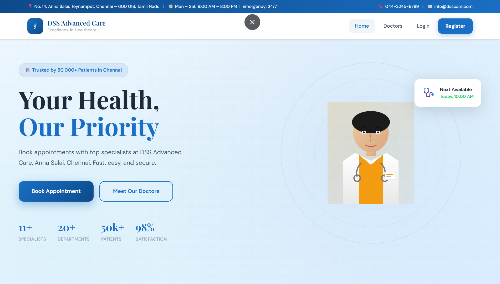
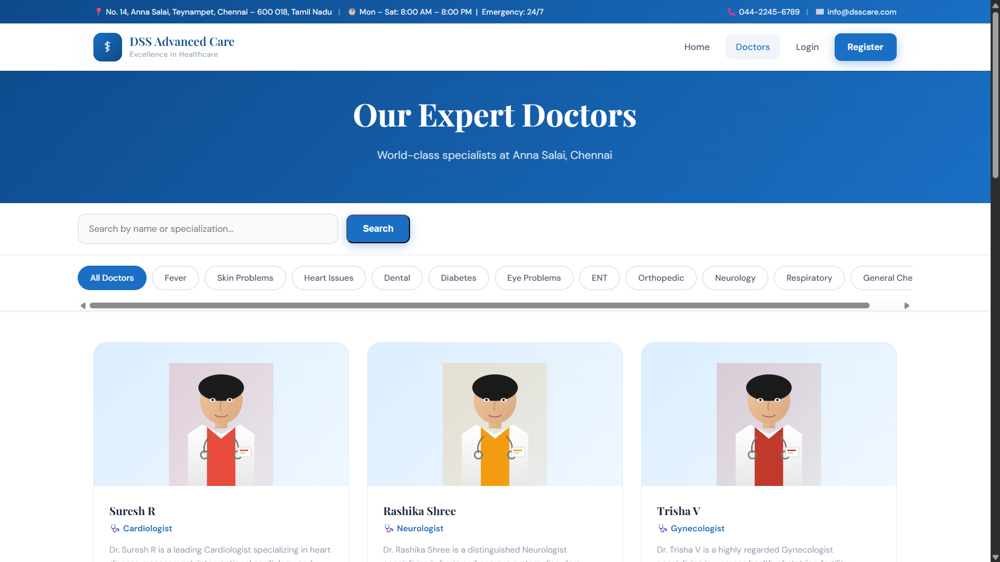

# DSS Advanced Care – Hospital Appointment Booking System

## 📸 Screenshots

### 🏠 Home Page



### 👨‍⚕️ Doctor Dashboard



---

## 🌟 Project Overview

DSS Advanced Care is a Hospital Appointment Booking System developed using PHP, MySQL, HTML, CSS, and JavaScript. The system allows patients to register, select health concerns, book appointments with doctors, and manage appointment history. Doctors can securely log in and view appointments through a dedicated dashboard.

---

## 🛠️ Technologies Used

* PHP
* MySQL
* HTML5
* CSS3
* JavaScript
* XAMPP

---

## ✨ Features

* Patient Registration & Login
* Doctor Login & Dashboard
* Disease-Based Doctor Selection
* Appointment Booking System
* Appointment History Management
* Doctor Specialization Filtering
* Payment Simulation
* Responsive User Interface
* Secure Password Hashing
* MySQL Database Integration

---

## 📋 Prerequisites

* XAMPP (Apache + MySQL)
* PHP 7.4 or above
* Modern Web Browser

---

## 🚀 Installation & Setup

### Step 1: Copy Project Files

Copy the project folder to:

```text
C:\xampp\htdocs\dss_advanced_care\
```

### Step 2: Start XAMPP

* Open XAMPP Control Panel
* Start Apache
* Start MySQL

### Step 3: Create Database

1. Open:

```text
http://localhost/phpmyadmin
```

2. Create a database named:

```text
dss_hospital
```

3. Open SQL tab
4. Import:

```text
db/setup.sql
```

### Step 4: Run the Project

Open:

```text
http://localhost/dss_advanced_care/
```

---

## 👥 Demo Doctor Login

| Doctor       | Email                                                   | Password |
| ------------ | ------------------------------------------------------- | -------- |
| Suresh R     | [suresh@dsscare.com](mailto:suresh@dsscare.com)         | password |
| Mathivanan M | [mathivanan@dsscare.com](mailto:mathivanan@dsscare.com) | password |
| Zainudeen    | [zainudeen@dsscare.com](mailto:zainudeen@dsscare.com)   | password |

Doctor Login URL:

```text
http://localhost/dss_advanced_care/doctor_login.php
```

---

## 📁 Project Structure

```text
dss_advanced_care/
│
├── assets/
│   ├── css/
│   └── js/
│
├── db/
│   └── setup.sql
│
├── includes/
│
├── screenshots/
│   ├── home-page.png
│   └── doctor-page.png
│
├── index.php
├── login.php
├── register.php
├── doctors.php
├── doctor_login.php
├── doctor_dashboard.php
├── book_appointment.php
├── confirmation.php
├── my_appointments.php
├── config.php
└── README.md
```

---

## 🗄️ Database Tables

* users
* doctors
* appointments
* slots

---

## 🎯 Learning Outcomes

* PHP Backend Development
* MySQL Database Design
* Session Management
* CRUD Operations
* Responsive Web Design
* Authentication System
* Full Stack Web Development

---

## 👨‍💻 Developer

**Suresh R**

B.Tech Information Technology

Ramco Institute of Technology

---

## 📌 Note

This project was developed for academic and learning purposes. The payment system included in the project is a simulation and does not process real transactions.
